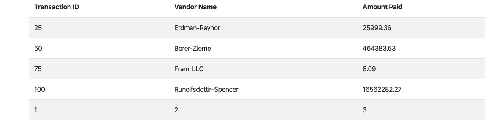

# <p align="center">HOW-TO: Security Based Research Project</p>
###### <p align="center">Ctrl-Alt-Elite: Zach Earl & Sam Bernstein</p> 

## Table of Contents 

##### I. Defining Security Vulnerabilities

[Injection](#injection)  
[Broken Authentication](#broken-auth)  
[Sensitive Data Exposure](#sensitive)  
[Broken Access Control](#broken-access)  
[Security Misconfiguration](#misconfig)  
[Cross-Site Scripting (XSS)](#xss)  
[Using Components With Known Vulnerabilities](#known-vulnerabilities)  
[Insufficient Logging and Monitoring](#logging)

##### II. Introducing the Bank of Piracy / The Bank of Privacy

[The Bank of Piracy](#unsecure)  
[The Bank of Privacy](#secure)

##### III. Scanning For Security Vulnerabilities

[Introduction to OWASP ZAP](#zap)  
[Results: The Bank of Piracy](#unsecureResults)  
[Results: The Bank of Privacy](#secureResults)

##### IV. Security Vulnerability Exploit Attacks   

[SQL Code Injection](#injection-attack)    
[Broken Authentication](#passwords-attack)  
[Cross Scripting Attack](#xss-attack)   
[Broken Access Control](#access-attack)    

##### V. Security Vulnerability Mitigations  

[SQL Code Injection](#injection-mit)   
[Broken Authentication](#encryption-mit)  
[Sensitive Data Exposure](#dataexp-mit)  
[Broken Access Control](#access-mit)   
[Cross-Site Scripting (XSS)](#xss-mit)   
[Insufficient Logging and Monitoring](#logging-mit)

## Defining Security Vulnerabilites

<a name="injection"/>

### Injection

An attacker may be able to manipulate a web application such that the submitted commands (to include the request and payload) are altered in order to steal secretive information, change data, or potentially erase traces of activity.

[OWASP Injection](https://owasp.org/www-project-top-ten/OWASP_Top_Ten_2017/Top_10-2017_A1-Injection.html)

<a name="broken-auth"/>

### Broken Authentication

Many applications will require a user to log in with a username and password combination, but attackers can utilize dictionary attacks, brute force, credential stuffing, session hijacking, and more to impersonate a user while the application cannot differentiate the attacker from the victim.

[OWASP Broken Authentication](https://owasp.org/www-project-top-ten/OWASP_Top_Ten_2017/Top_10-2017_A2-Broken_Authentication.html)

<a name="sensitive"/>

### Sensitive Data Exposure

Sensitive data should be protected using encryption or other cryptographic algorithms, but attackers can exploit unencrypted data, custom encryption schemes (opposed to proven algorithms), weak keys, exposed encryption keys, and improperly implemented protocols to steal information such as credit cards, passwords, personal information, and critical business data.

[OWASP Sensitive Data Exposure](https://owasp.org/www-project-top-ten/OWASP_Top_Ten_2017/Top_10-2017_A3-Sensitive_Data_Exposure.html)

<a name="broken-access"/>

### Broken Access Control

Most web applications restrict what a user can see and do, but an attacker may find a way to bypass these controls to reach unauthorized data.

[OWASP Broken Access Control](https://owasp.org/www-project-top-ten/OWASP_Top_Ten_2017/Top_10-2017_A5-Broken_Access_Control.html)

<a name="misconfig"/>

### Security Misconfiguration

The application stack contains many moving components that need to be interconnected with proper configurations, and there is no single setting to protect the application, so all potentially vulnerable settings must be reviewed.

[OWASP Security Misconfiguration](https://owasp.org/www-project-top-ten/OWASP_Top_Ten_2017/Top_10-2017_A6-Security_Misconfiguration.html)

<a name="xss"/>

### Cross-Site Scripting (XSS)

An attacker can alter the the web pages that other users see when using the application, and the vulnerability can occur whenever unverified data is included in a web page response without proper validation and sanitization.

[OWASP Cross-Site Scripting](https://owasp.org/www-project-top-ten/OWASP_Top_Ten_2017/Top_10-2017_A7-Cross-Site_Scripting_(XSS).html)

<a name="known-vulnerabilities"/>

### Using Components With Known Vulnerabilities

Many web applications have multiple software dependencies, and if there are vulnerabilities within the dependencies then the same vulnerabilities also put the web application and its data at risk.

[OWASP Using Components With Known Vulnerabilities](https://owasp.org/www-project-top-ten/OWASP_Top_Ten_2017/Top_10-2017_A9-Using_Components_with_Known_Vulnerabilities.html)

<a name="logging"/>

### Insufficient Logging and Monitoring

Some attacks may penetrate even the best security defenses, but a proper security system will have many layers that provide the organization ample ability to recover against the attack or minimize damage.

[OWASP Insufficient Logging and Monitoring](https://owasp.org/www-project-top-ten/OWASP_Top_Ten_2017/Top_10-2017_A10-Insufficient_Logging%252526Monitoring.html)

## The Bank of Piracy / The Bank of Privacy

<a name="unsecure"/>

### Bank of Piracy

The Bank of Piracy is the unsecure version of the application.  The front-end of the application uses HTML and CSS in conjunction with Express Framework to deliver the user an interactive online bank account.  The back-end of the application is a Node.js server combined with a MySQL relational database.  There are user accounts stored in the database with user authentication via the login page and the user can input data to pay their credit card bill, update the personal information on their account, or search their list of transactions for a specific vendor.  All data are stored in the database in plaintext with the exception of passwords, which are encrypted for storage in the database using SHA1, a cryptographic hash function that takes a plaintext input and generates a 160-bit hash value that is rendered as a 40-digit hexadecimal number.  Use of SHA1 is no longer recommended due to its associated vulnerabilities, but hash functions can provide a false sense of security simply because they are not supposed to be unhashable.

<a name="secure"/>

### Bank of Privacy

The Bank of Privacy is the secure version of the application.  The front-end of the application is written in TypeScript, HTML, and CSS through Angular, an open-source framework for web applications originally developed and maintained by Google.  The back-end of the application...

## Scanning For Security Vulnerabilities

<a name="zap"/>

### Introduction to OWASP ZAP  

The Open Web Application Security Project (OWASP) is a nonprofit working to advance the security of software through community-driven open source development.  Zed Attack Proxy (ZAP) is a tool created by OWASP to perform security testing in a manner that can be understood by individuals ranging in experience from novice to expert.  ZAP is a penetration testing tool specifically designed for web applications and functions primarily as a "man-in-the-middle proxy" by intercepting and monitoring data transmitted between the browser and web application.  The tool should only be run on sites that you have permission to attack as the simulation functions like a real attack and has the potential to damage the appication's functionality, data, etc.

[About ZAP and Instructions for Use](https://www.zaproxy.org/getting-started/)

<a name="unsecureResults"/>

### OWASP Zap Scanning Results: Bank of Piracy

<a name="secureResults"/>

### OWASP Zap Scanning Results: Bank of Privacy

## Security Vulnerability Exploit Attacks

<a name="injection-attack"/>

### SQL Code Injection

An avid hacker could observe the Bank of Piracy application to see if there are any security vulnerabilities that he can exploit and the search bar immediately draws his attention since it fetches data, in this case, customer transactions, from the database then displays those the customer searched for. He believes this may be susceptible to exploitation and thus tests his theory by entering a single quote: “ ‘ “ in the input field of the search bar. This results in a ERR_INVALID_RESPONSE error message which piques his interest since this means that the appropriate security measures are not in place to escape malformed queries else it would simply display no results in the columns. 

He further tests this theory by entering these characters in the search bar: 
###### Note: *A space needs to be appended at the end of the search for injection to be successful*

```' -- ```

This displays all of his transactions which means that the “’ — ” escaped the rest of the query on the backend thereby getting all of his transactions since no input was entered between the wildcards. He could contemplate his next step by observing there are three columns and visualizes the SQL query on the backend server being: 

```SELECT ?, ?, ? FROM ? WHERE ? LIKE ‘%[input]%’;```

He tests this theory by entering this input:

```’ UNION(SELECT 1, 2, 3 FROM DUAL) -- ```

And is redirected to the transactions page where these results are displayed:



As you can observe, the digits 1, 2, 3 are appended to the three columns respectively confirming his theory. The reason why these digits were appended is because the attacker used the UNION clause which is used to combine the result from multiple SELECT statements into a single result set. The result set column names are taken from the column names of the first SELECT statement i.e. the query on the server used to fetch the search results. Now that his theory is confirmed, he can start injecting SQL code to steal customer’s sensitive data such as passwords, checking accounts, and credit cards. However, in order to exploit this, he must find out the names of the tables this data is stored and so he injects this SQL code in the search bar:

```’ UNION(SELECT table_name, 2, 3 FROM information_schema.tables) – ```

This results in the data from the information schema for all the tables that exist in the Bank of Piracy’s database being appended in the three columns after his transactions. Now, he can hypothesize which tables are the ones containing the information he wants and speculates it could be in the ‘customer’ table:


The attacker now has an idea of what the tables names could be and so now he wants the names to the columns, he enters this query into the search bar:

```’ UNION(SELECT column_name, 2, 3 FROM information_schema.columns WHERE table_name = ‘customer’) – ```

This appends all of the column names from the customer table to the end of his transactions effectively providing Tyrese the information that he was looking for to steal other customers data. As such, he speculates that the columns ‘passwords’ contain the information he wants:


With knowledge of the column names, the attack just needs to enter this query in the search bar:

```’ UNION(SELECT username, password, 3 FROM customer) – ```

The attacker has successfuly acquired all of the Bank of Piracy's usernames and hashed passwords in the database:


<a name="passwords-attack"/>

### Broken Authentication 

In the previous scenario, our hacker had injected a malformed SQL query into the search box of the Bank of Piracy application to steal not only other customers’ credit cards and checking account information but their hashed passwords as well. A Harris Poll conducted in August of 2019, found that 75 percent of its 3,419 respondents from 12 states struggle to remember their passwords, and this leads them to make poor security choices such as reusing passwords (66 percent); sharing passwords (43 percent); using common passwords such as “abc123,” “Iloveyou,” and “Qwerty” (24 percent); and using easy-to-guess personal information such as birthdays and names of relatives (including themselves) as part of their passwords (59 percent). Therefore, at least according to this research, there should be approximately ~59% customers that have poorly thought up extremely unsecure common passwords [1]. 

Our hacker decides to put this theory to the test, he quickly performs a search on Google to see what software is highly recommended by information security professionals to crack passwords. On the first page, he finds a Kali Linux tool called Hashcat which Infosec Resources even provides a tutorial for beginners. Hashcat is a well-known password cracker, it is designed to break even the most complex passwords. To do this, it enables the cracking of a specific password in multiple ways, combined with versatility and speed. The Bank of Piracy’s passwords are associated with SHA1 hash keys, this is a mathematical operation that is easy to perform, but very difficult to reverse engineer. Hashcat turns readable data into a garbled state (this is a random string of fixed length size). Hashes do not allow someone to decrypt data with a specific key, as standard encryption protocols allow. Hashcat uses precomputed dictionaries, rainbow tables, and even a brute-force approach to find an effective and efficient way crack passwords [2]. 

#### Dictionary Attack

The simplest way to crack a hash is to try first to guess the password. Each attempt is hashed and then is compared to the actual hashed value to see if they are the same. Dictionary and brute-force attacks are the most common ways of guessing passwords. These techniques make use of a file that contains words, phrases, common passwords, and other strings that are likely to be used as a viable password. Our hacker follows the tutorial and opts to use a dictionary attack, to use it, he needs a wordlist. It just so happens that Kali Linux has a number of wordlists built right into it and all he has to is type in the terminal:

``` hashcat -a 0 -m 100 -o ~/output.txt ~/Desktop/passwords.txt ~/usr/share/wordlist/rockyou.txt ```

- -m 100 designates the type of hash we are cracking (SHA1)
- -a 0 designates a dictionary attack
- -o output.txt is the output file for the cracked passwords
- passwords.txt is our input file of hashed passwords
- /usr/share/wordlists/rockyou.txt
is the absolute path to the wordlist file for this dictionary attack and is highly recommended since it is a fairly lightweight yet powerful wordlist compared to other choices.

The result of output.txt:

```
7c4a8d09ca3762af61e59520943dc26494f8941b:123456
5baa61e4c9b93f3f0682250b6cf8331b7ee68fd8:password
5bc1824930ffbbafc27e7eb204260a4017859a35:ferrari
6a4fe8b1c615ce704e72e4b450b3325eb022492e:zachary
d0be2dc421be4fcd0172e5afceea3970e2f3d940:apple
cbfdac6008f9cab4083784cbd1874f76618d2a97:password123
6751bd9db11552b8ebc844059420b65a308015fa:blueberry
1f6ccd2be75f1cc94a22a773eea8f8aeb5c68217:pizza
23871edd97b628faca29e9328806c1514d289e88:penguins
a51dda7c7ff50b61eaea0444371f4a6a9301e501:john
048ab27836e54e815a07ad3e2ad43e4cd71efba2:kobebryant
f661e87dcaab9d2db81bb649be345e361c54ba9b:buckeyes
2d3b814856a4914292468ff54442afbe921287dd:tombrady12
ea9355e059ee52d22d6b147442545eb5d6fe30d3:dolphins13
f7408171b988450b85755c5273c6e829f19345e8:Scarface
eebf26b3016b7fa7dff2a18962d32e0dfd78f388:Steelers
2b3e371486dee4f954150c7863877108b7d4881d:kingjames23
68a57310886ef9df2b555a9d94950132059f7276:Patriots
5646f044750172cde4597f35e9fa11162a7a9781:iamtoocool
3af479a81aa396f8e3a353fa2d9f7d68919aed18:chicagobulls23
2e7b153d82dc47a055b16f652bfe04b0a16b5d95:September24
948a417461ea05242c48f2f4b224e52b70a27c40:therock34
b358486187ed10ab2ba622e449f664a72d3453e2:Reds
```

The attacker has the passwords to every customer in the Bank of Piracy and can break into their accounts effortlessly.

<a name="dataexp-mit"/>

### Sensitive Data Exposure

<a name="access-attack"/>

### Broken Access Control

The Bank of Piracy leaves user data at risk by failing to protect against account access by unauthorized users.  There is no explicit protection for any of the application's routes, which means that all routes associated with the application can be accessed by anyone via URL.  Although there is a login page to verify a username and password combination, it can easily be bypassed by manually changing the route in the URL. 

<a name="xss-attack"/>

### Cross Scripting Attack (XSS Attack)

Now that our attacker has successfully injected malicious SQL code to access virtually all of the Bank of Piracy's data, he can login to a customer’s account to inject malicious Javascript to potentially derive even more sensitive information like credit cards and accounts from other banks, passwords to social media accounts, employer secrets, etc. To accomplish this, he takes a play from even more experienced exploiters’ playbooks by observing how his parents, friends, and generally how anybody usually fall victim to these attacks – through popups displaying a warning that their computers have been infected with a virus that download their own virus disguised to resolve the façade that never actually existed by clicking a button. According to OWASP, this type of XSS attack is categorized as stored attacks, the injected script is permanently stored on the target servers, such as in a database in this case. The victim then retrieves the malicious script from the server when it requests the stored information. Stored XSS is also sometimes referred to as Persistent or Type-I XSS.

The attacker is going to use a similar attack based off this design, he’s going to use the following HTML which creates a modal displaying message that their bank account has been compromised for fraud and that the customer needs to contact the number displayed immediately and use the software downloaded on their computer to resolve the issue:

```javascript
<dialog open><p>Your account is being investigated for fraud, please call 555-555-5555 and use the software downloaded.</p><a href = "/file.txt" download = "file.txt"><button>Ok</button></a></dialog>
```

##### XSS Attack By Updating Customer  

To execute this attack, he logs in using the passwords he cracked earlier then injects his script in the field used to update the customer since it will redirect back to the dashboard where he can display the modal as soon as the customer logs in:


The customer is redirected to the dashboard where his snapshot info is obstructed by this modal downloading this file when he clicks ok:


## Security Vulnerabilty Mitigations 

<a name="injection-mit"/>

### SQL Code Injection

In order to understand how to mitigate SQL injection, we must first grasp the concepts as to what makes a web application vulnerable to SQL injection in the first place. When breaking down our hacker’s SQL injection attack, we explained how commenting out the rest of the intended query (--) permits our hacker to combine multiple SELECT statements with UNION into a single result set. Why was our hacker able to do this? Examine the following code to search for a particular transaction that our hacker exploited: 

```javascript
app.get('/search/:id', (req, res, next) => {
    let context = {};
    let query = "SELECT * FROM transactions WHERE account_id = " + req.params.id + " AND vendor_name LIKE " + "'%"+req.query.vendor+"%'";
    pool.query(query, (err, result) => {
        if(err) {
            next(err);
            return;
        }
        context.transactions = result;
        res.render('transactions', context);
    });
});
```

When you use string concatenation to build an SQL query, you're making a mistake. This mistake is treating the query and the parameters of the query as if they were the same. A query is code; it is run and it can do things: it can modify tables and rows and so on. The parameters, however, are simple data. They just represent a static value. When you mistakenly treat user input as if it is safe code, you get SQL injection. Using prepared queries and treating user input as potentially unsafe data prevents this particular attack. In short, our hacker used “’ UNION(SELECT password, email, 3 FROM customer) -- “ as a string concatenated to the query resulting in:

``` SELECT id, vendor_name, amount_paid FROM transactions WHERE account_id = " + req.params.id + " AND vendor_name LIKE " + "'%’ UNION(SELECT password, email, 3 FROM customer) -- %'"```

#### Object/Relational Mapping (ORM)

In object oriented systems, we represent entities as objects, and use a database to persist those objects. Generally these objects are considered non-scalar values (non-primitive types). But many databases can only store and manipulate scalar values organized in tables. The crux of the problem is translating those objects to forms which can be stored in the database, and which can later be retrieved easily, while preserving the properties of the objects and their relationships; these objects are then said to be persistent. Hibernate attempts to address this problem with Object/Relational Mapping by mapping attributes of objects we wish to persist to columns of a database. In the BankofPrivacy , this identifier will be mapped using class objects using active record patterns in conjunction with Java Spring Boot annotations, you will see this mapping in the element. This file will also map all other object properties we wish to preserve to columns in a database table, along with their data types and other attributes. Observe the code below for AccountRecord which creates to the account table in the database:

```javascript
@Entity
@Table(name = "account")
public class AccountRecord {
	@Id @GeneratedValue(strategy = GenerationType.IDENTITY)
	@Column(name = "id")
	private Integer accountId;
	@Column(name = "checking_account")
	private String checkingAccount;
	@Column(name = "credit_card")
	private String creditCard;
	@Column(name = "checking_balance")
	private Double checkingBalance;
	@Column(name = "credit_card_balance")
	private Double creditCardBalance;
	@OneToOne(optional = false, cascade= CascadeType.ALL)
	@JoinColumn(name = "customer_id")
	private CustomerRecord customer;
```

This code is followed by the constructor, getters, and setters that we use to set and get data from our active records. At this point, you are likely scratching your head pondering why this has anything to do with mitigating SQL injection. Lets compare code on how the BankofPiracy gets transactions compared to the Bank of Privacy:

The Bank of Piracy:

```javascript
app.get('/transactions/:id', (req, res, next) => {
    let context = {};
    let query = "SELECT t.id, t.vendor_name, t.amount_paid FROM transactions t INNER JOIN account a ON t.account_id = a.id WHERE a.customer_id = " + req.params.id;
    pool.query(query, (err, result) => {
        if(err) {
            next(err);
            return;
        }
        context.transactions = result;
        context.id = req.params.id;
        res.render('transactions', context);
    });
});
```
The Bank of Privacy:

```javascript
public List<Transactions> getTransactions(Integer customerId) {
		EntityManager entityManager = entityManagerFactory.createEntityManager();
		CustomerRecord c = (CustomerRecord)entityManager.find(CustomerRecord.class, customerId);
		entityManager.detach(c);
		String sql = "FROM TransactionsRecord t WHERE t.account.customer = “+ customer;
		TypedQuery<TransactionsRecord> query = entityManager.createQuery(sql, TransactionsRecord.class);
		query.setParameter("customer", c);
		List<TransactionsRecord> t = query.getResultList();
		List<Transactions> transactions = new ArrayList<>();
		for (int i = 0; i < t.size(); i++) {
			transactions.add(new Transactions(t.get(i)));
		}
		entityManager.close();
		return transactions;
	}
```

Now that you’ve observed and hopefully digested this code, it should be fairly obvious as to what the differences are and why ORM mitigates SQL injection. Think back to when our hacker was brainstorming and theorizing how to inject malformed SQL code, he was visualizing SQL queries. Unless he would theorize that the server must be using Hibernate object relational mapping in conjunction with HQL on their backend, he would not know how to visualize this query. Moreover, when the attack used the UNION query to combine the data of all table name information in the three columns, this would have not been possible since there’s information.table schema in Hibernate. Nonetheless, as OWASP recommends Hibernate for its guards against SQL injection, it also points out that Hibernate does not grant immunity to SQL Injection, one can misuse the API as they please. Examining our method above, it appears that we still use string concatenation to build an HQL query [3].

#### Parameterized Queries 

For purposes of strengthening our security measures, let’s assume our attacker is actually a seasoned Java developer with experience in architecting ORM and therefore knows how to send a nefarious HQL query to the server. How would we the BankofSecurity mitigate this attack? In short, parameterized queries enforce data typed user input to be used as parameters embedded in the SQL/HQL statement:

```javascript
public List<Transactions> getTransactions(Integer customerId) {
		EntityManager entityManager = entityManagerFactory.createEntityManager();
		CustomerRecord c = (CustomerRecord)entityManager.find(CustomerRecord.class, customerId);
		entityManager.detach(c);
		String sql = "FROM TransactionsRecord t WHERE t.account.customer = :customer";
		TypedQuery<TransactionsRecord> query = entityManager.createQuery(sql, TransactionsRecord.class);
		query.setParameter("customer", c);
		List<TransactionsRecord> t = query.getResultList();
		List<Transactions> transactions = new ArrayList<>();
		for (int i = 0; i < t.size(); i++) {
			transactions.add(new Transactions(t.get(i)));
		}
		entityManager.close();
		return transactions;
	}
  ```
  
As you can observe, query.setParameter(“customer”, c) enforces the parameter :customer as a CustomerRecord data type. If our attacker would have sent the malformed query as he did when exploiting the search box in the web app then it was just be viewed as a string data type and returned no results which is why his interest was piqued when he sent a single quote. The Bank of Privacy now uses ORM in conjunction with parameterized queries as well as limited permissions on the MySQL database server to mitigate SQL injection. 


<a name="encryption-mit"/>

### Broken Authentication

The encryption that the BankofPiracy used was SHA-1 which is fairly standard encryption, Google states they hope their practical attack on SHA-1 cements that the protocol should no longer be considered secure and will finally convince the industry that it is urgent to move to safer alternatives such as SHA-256. Google generated a cryptographic collision, and then professed that moving forward, it’s more urgent than ever for security practitioners to migrate to safer cryptographic hashes such as SHA-256 and SHA-3. The fact that our attacker could use Hashcat to perform a dictionary attack on the BankofPiracy’s hashed passwords is due to a lack of strong password policy and encryption 

#### Password Policy

Passwords should be at least eight (8) characters long, combining this length with complexity makes a password difficult to guess and/or brute force such as the dictionary attack used before. Additionally, Password characters should be a combination of alphanumeric characters. Alphanumeric characters consist of letters, numbers, punctuation marks, mathematical and other conventional symbols. You should not store the actual passwords to protect against brute forcing if the database file is compromised. The BankofPrivacy follows these guidelines set forth, customers must now enter a 8 character password consisting of at least one uppercase alphabetic character, lowercase alphabetic character, numeric character, and a special character. The passwords the attacker cracked did not follow this new policy set forth, this in addition to them being a weakly encrypted using SHA-1 is why they were compromised.

#### Encryption with Salt 

With unsalted hashed passwords, the attacker could try a dictionary attack. Using a pre-arranged listing of words, such as the entries from the English dictionary, with their computed hash, the attacker easily compares the hashes from a stolen passwords table with every hash on the list. If a match is found, the password then can be deduced which is exactly what our password cracker did. To mitigate the damage dictionary attack could do, we salt the passwords. According to OWASP Guideliness, a salt is a fixed-length cryptographically-strong random value that is added to the input of hash functions to create unique hashes for every input, regardless of the input not being unique. A salt makes a hash function look non-deterministic, which is good as we don't want to reveal password duplications through our hashing. 

On the back-end of the application the password is encrypted using Bcrypt, a one-way slow hashing method that takes a plaintext password and hashes it with salt, a unique random string added to the password prior to hashing, in ordered to further obfuscate the password and protect against dictionary or rainbow table attacks. The one-way nature of Bcrypt's password hashing means that password verification is completed by hashing the user-entered password and checking if it is a match for the hashed password stored in the database rather than decrypting the password stored in the database and seeing if it matches the user-entered plaintext value. SHA-1 is a cryptographic hash while bcrypt is a password hash or PBKDF (password based key derivation function). SHA-1 has been designed to be fast. You don't want any delays when validating a signature, for instance. There is no reason for generic cryptographic hashes to be slow. Bcrypt on the other hand is a password hash that performs key strengthening on the input. Basically it does this by slowing down the calculation so that attackers will have to spend more resources to find the input by brute forcing or dictionary attacks. The idea is that although the legit users will also be slowed down, they are only slowed down once per password. However the attackers are slowed down for each try. The legit user is of course much more likely to input the right password first. Furthermore bcrypt also contains a salt as input, which can be used to avert rainbow table attacks as well.


<a name="dataexp-mit"/> 

### Sensitive Data Exposure

The Bank of Privacy employs methods on the front-end, back-end, and in between to protect sensitive data from exposure to risk.  On the front-end the user is only shown the last four digits of their account number and credit card, which is just enough information to verify that they are correct but not enough to leave the user at risk if someone should gain unauthorized access to the account.  The user has the ability to hide their username and password in their respective fields on the personal information update form so that they are indiscernible to the naked eye.  Data passed between the front and back-end of the application has increased protection through Hypertext Transfer Protocol Secure (HTTPS), an extension of HTTP that utilizes Transport Layer Security (TLS) to employ cryptographic protocols for secure communications over a computer network.  HTTPS relies on the use of certificates to authenticate the site being accessed, verifies a secure connection between the client and server through symmetric cryptography, and provides a secure data pipeline between the two through bidirectional encryption of communications.  These protocols assist in protecting against man-in-the-middle attacks, eavesdropping, and interference with communications, and there is little to no support from browsers when attempting to achieve these results with standard HTTP.  The data is stored in the database when it reaches the back-end, and once the password is entered it never gets decrypted, meaning there is very little risk that the password will be cracked without severe involvement.

<a name="access-mit"/>

### Broken Access Control

The Bank of Privacy uses sessions in order to prevent accounts from being accessed without authorization. Additionally, routes in the application do not employ the use of parameters to pass the user id to one another, thereby adding an additional layer of protection against broken access to user data. The login page and new user registration page are accessible without the creation of a session, which occurs after a user enters a correct username and password combination to log into an account.  Once logged into an account, a user can access the dashboard, view their transactions, pay their credit card bill, and update their personal information.  When a user logs out of the account, the session is terminated and the user must present their credentials again in order to regain access to the pages beyond the login screen.  The new user registration page is meant to be accessed from a button on the login page but can also be accessed directly via URL, so when the page is loaded it automatically makes sure that there is no current session in order to prevent the possible contamination of data submitted in the form.

<a name="xss-mit"/>

### Cross Scripting Attack  

To mitigate XSS attacks, the Bank of Privacy opted to use the Angular framework which provides DOM sanitization and a content security policy. To systematically block XSS bugs, Angular treats all values as untrusted by default. When a value is inserted into the DOM from a template, via property, attribute, style, class binding, or interpolation, Angular sanitizes and escapes untrusted values. When our attacker updated the customer’s name using Javascript code to create a modal to pop up on the dashboard, Angular’s cross scripting model would have prevented this attack since it would escape the <script> tags effectively making them part of the data string being displayed. This also protects against the hazardous eval() method that interprets Javascript as a string which can be concatenated (I know because I tried to break it that way) [4]. 

#### Dom Sanitization

Sanitization is the inspection of an untrusted value, turning it into a value that's safe to insert into the DOM. Angular sanitizes untrusted values for HTML, styles, and script tags. Angular also has a  HttpClient library that recognizes this convention and automatically strips the string ")]}',\n" from all responses before further parsing. Angular prints a console warning when it has to change a value during sanitization and prevents the attack from occurring before it executes. Angular even furthers its security measures by escaping scripting tags when utilizing its data binding feature. Even if the BankofPrivacy’s banner printing “Welcome” followed by the customer’s name were binded by HTML rather than data sent by the database, it would have still prevented the attack. Angular recognizes the script tag as unsafe and automatically sanitizes it, which removes the <script> tag but keeps safe content such as the <p> elements. As a second layer, you can implement router parameters for whether or not a given route requires authorization, and not display it until and unless an authorization check returns positively [4].


<a name="logging-mit"/>

### Logging 

The Bank of Piracy not only failed to mitigate attacks such as XSS, injection, password cracking, and broken access but also failed to log and then trace back the source of these attacks. In other words, they ultimately failed to maintain record of errors, breaches, and exceptions that could have shed light on what caused these attacks to begin with. If trace logging was implemented, they could have traced which user logged in to the application to inject the nefarious query to fetch the information.table schema that eventually stole the customers’ hashed passwords. The Bank of Privacy equips Apache Log4j2 for its logging framework in its Spring Boot architecture, observe the following configuration file, log4j2.properties:

```
spring.output.ansi.enabled=ALWAYS

name=PropertiesConfig
property.filename = logs
appenders = console, file

appender.console.type = Console
appender.console.name = STDOUT
appender.console.layout.type = PatternLayout
appender.console.layout.pattern = [%-5level] %d{yyyy-MM-dd HH:mm:ss.SSS} [%t] %c{1} - %msg%n
appender.file.type = File
appender.file.name = LOGFILE
appender.file.fileName=${filename}/propertieslogs.log
appender.file.layout.type=PatternLayout
appender.file.layout.pattern=%highlight{%d{HH:mm:ss.SSS} %-5level %logger{36}.%M() @%L - %msg%n}{FATAL=red blink, ERROR=red, WARN=yellow bold, INFO=black, DEBUG=green bold, TRACE=blue}

loggers=file
logger.file.name=com.osu.capstone.project.unsecure.log4j2properties
logger.file.level = debug
logger.file.appenderRefs = file
logger.file.appenderRef.file.ref = LOGFILE

rootLogger.level = debug
rootLogger.appenderRefs = stdout
rootLogger.appenderRef.stdout.ref = STDOUT
 
log4j.rootLogger=info, stdout
# basic log level for all messages
log4j.logger.org.hibernate=info
 
# SQL statements and parameters
log4j.logger.org.hibernate.SQL=debug
log4j.logger.org.hibernate.type.descriptor.sql=trace
```

Log4j2 uses appenders to log output, the Bank of Privacy logs output to the console as well as files in a log directory for one week. Since logging everything to one file is not ideal, we use the rolling file appender to create a log file when it reaches a certain limit based on the default settings. As you can observe in our configuration, we have Hibernate set up for both trace and debug to catch exceptions and trace database transactions which would trace the source of the cause of a malicious attack to the database. 


## References  
[1]: https://the-parallax.com/2019/10/02/harris-poll-google-password-security/
[2]: https://resources.infosecinstitute.com/hashcat-tutorial-beginners/
[3]: https://owasp.org/www-community/Hibernate
[4]: https://angular.io/guide/security
